# Asistente de Viajes

Para la persona con poco tiempo quienes quieran organizarce para realizar un viaje, el Asistente de Viajes es un bot con inteligencia artificial que te ayuda a responder consultas sobre destinos, sus climas y recomendación de equipaje. Diferente a otros bots cuyo único trabajo es trabajar solo con apis y sin respuesta en lenguaje humano. 

## CONTENIDO

- [Características únicas](#caracteristicas-unicas)
- [Empezar a utilizar](#empezar-a-utilizar)
    - [¿Dónde probar la API?](#dónde-probar-la-api)
    - [¿Cómo se utiliza?](#cómo-se-utiliza)
    - [Utilizar bot en local](#utilizar-el-bot-en-local)
    - [Chatear con el bot desde terminal](#chatear-con-el-bot-desde-terminal)
- [Funcionalidades](#funcionalidades)
    - [Persistencia de hilo de conversación](#persistencia-de-hilo-de-conversación).
    - [Cambiar el hilo de conversación](#cambiar-el-hilo-de-conversación)
    - [Obtener el clima de una ubicación dada una fecha](#obtener-el-clima-de-una-ubicacion-dada-una-fecha).
    - [Obtener el clima de una ubicación dado una cantidad de dias](#obtener-el-clima-de-una-ubicación-dado-una-cantidad-de-dias)
- [Tecnologias y Librerias](#tecnologias-y-librerias)
    - [Modelo de Grafo](#modelo-de-grafo)


## Características únicas 
1. **Respuestas conversacionales**
    - Trabaja con el modelo de LLM `gpt-4o-mini-2024-07-18` para enternder preguntas coloquiales y responder de forma rapida, precisa y amigable.
2. **Clima en tiempo real** 
    - Integra la api de OpenWeatherMap y la presenta de forma amigable.
3. **Seguimiento contextual**
    - Puede manejar preguntas adicionales sin perder el hilo de la conversacion.
    - Te responde con datos concretos y estructurados.
    - Si le preguntas de temas que exceden su objetivo, para y te pide que le consultes de temas que conoce.
 
## Empezar a utilizar 
El bot se puede utilizar tanto local, como desde la siguiente api:
 `https://asistente-de-viajes.vercel.app/api/chat`

### ¿Dónde probar la API?
Para testear la api se pueden utilizar herramientas como [Insomnia](https://insomnia.rest/) o [Postman](https://www.postman.com/). 
### ¿Cómo se utiliza?
Para trabajar con la api de asistente de viajes, se le debe enviar un body con el siguiente formato.

```js
{
    "message": "<consulta>"
}

```

**Ejemplo:**
```js
{
    "message": "¿Cómo estará el clima en Buenos Aires, Argentina, dentro de dos días?"
}
```
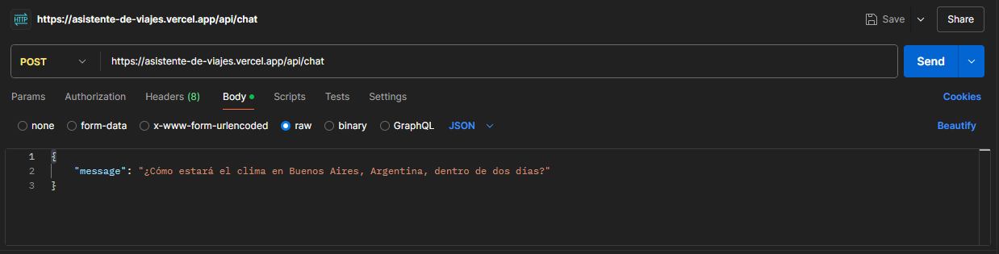
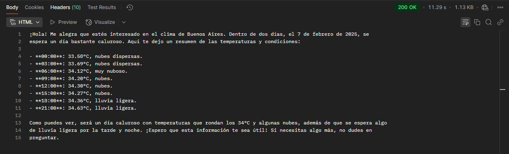
### Utilizar el bot en local
Antes de utilizar el asistente en tu maquina tenes que tener en cuenta los siguientes prerrequisitos:
    
1. Tener instalado [Node.js]() y [Git]().
2. Tener una ApiKey de [OpenAI]() y [OpenWeatherMap]().

Una ves conseguidos los prerrequisitos toca clonar el repositorio de la siguiente manera:
```sh
git clone https://github.com/ElianBorda/asistente-de-viajes.git
cd asistente-de-viajes
npm install
```
Despues de clonar y acceder al repositorio, se debe crear un archivo .env para agregar las apikey y la base url de la api de OpenWeatherMap. 
```js
API_OPENWHATER = "http://api.openweathermap.org/data/2.5"
API_OPENWHATER_KEY = "..."
OPENAI_API_KEY = "..."
```
Por ultimo, deben corren la api local de la siguiente forma:
```sh
npx tsc
node dist/app.js
``` 
Una ves realizado el ultimo paso, les aparecera el mensaje `Servidor corriendo en http://localhost:3000`:
 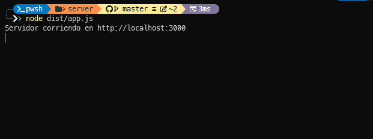

**Muestra:**
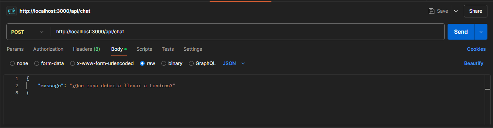
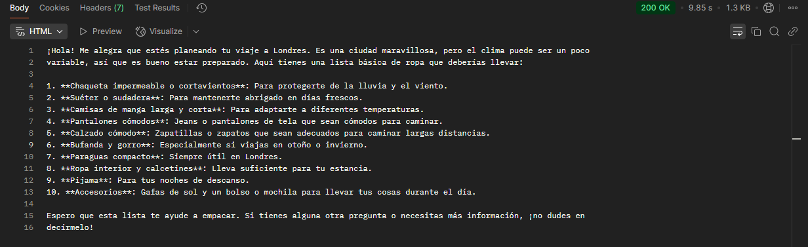

### Chatear con el bot desde terminal
Si instalas el bot local tenes la opcion de **chatear con el asistente en tiempo real**. Solamente se necesita escribir el siguiente comando:

```sh
npx tsx src/index.ts
```

**IMAGENES ESCRIBIENDO POR CHAT CON EL ASISTENTE:**
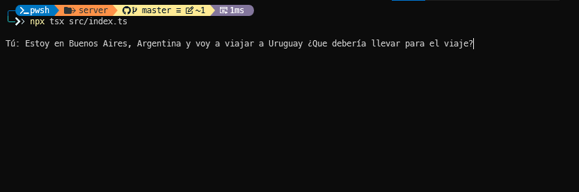
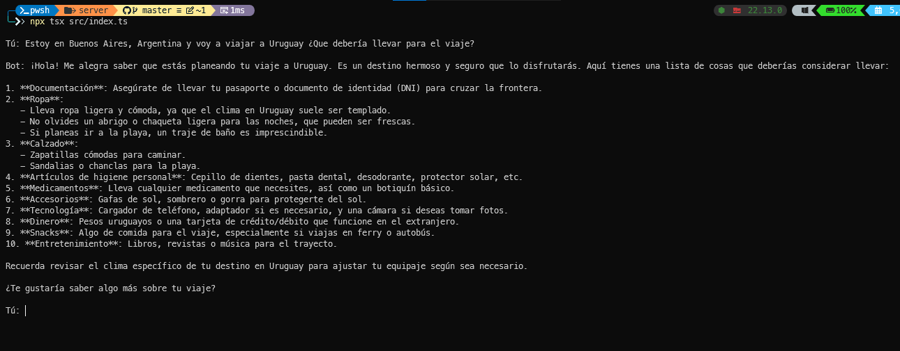

## Funcionalidades
A continuacion se expondra todas las funcionalidades que vuelven particular al asistente. Por comodidad se utilizara la terminal. 
### Persistencia de hilo de conversación
El Asistente de Viajes tiene la capacidad de persistir el hilo de conversación, esto quiere decir que recuerda los momentos de cada consulta y respuesta que se genero. 
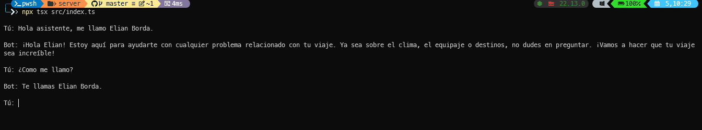
### Cambiar el hilo de conversación
Para cambiar el hilo de conversación se utiliza query params en la url `https://asistente-de-viajes.vercel.app/api/chat` de la siguiente forma: 
```js
    https://asistente-de-viajes.vercel.app/api/chat?thread_id=<unId>
```
**Realizamos el ejemplo en Postman:**
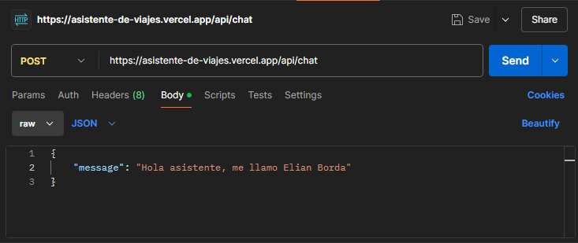
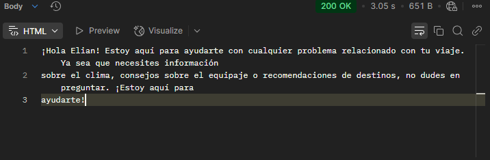

Le preguntamos como me llamo: 
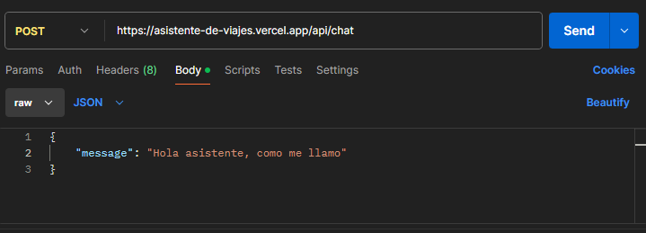
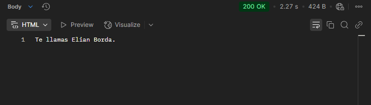

Ahora cambiamos el hilo de conversación:

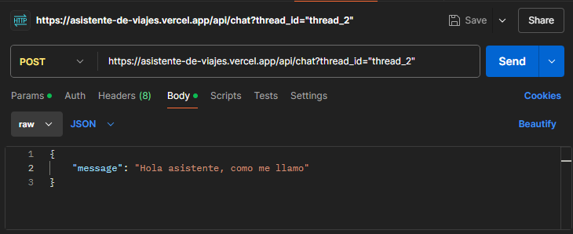
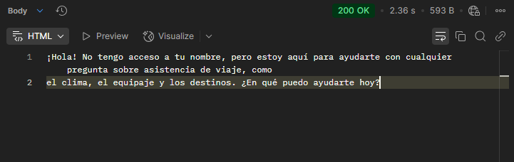


### Obtener el clima de una ubicacion dada una fecha.
Gracias a la Api de OpenWeatherMap puedo consultar el clima de una fecha dada.
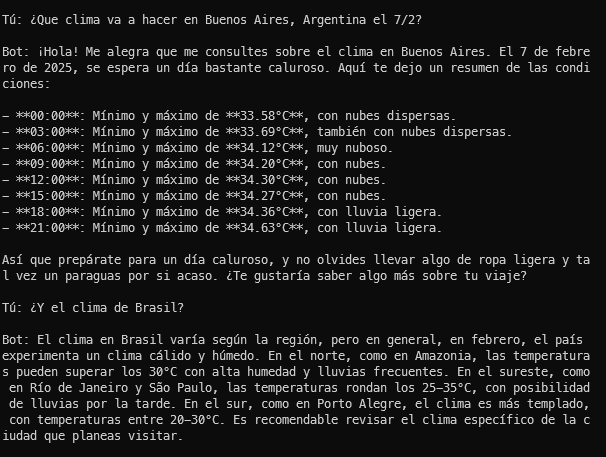
### Obtener el clima de una ubicación dado una cantidad de dias
El asistente conoce el año, mes, dia y horario actual, por lo que no es de suma necesidad pasarle una fecha. A partir de una cantidad de dias y teniendo en cuenta el dia actual, puede determinar la fecha solicitada. 
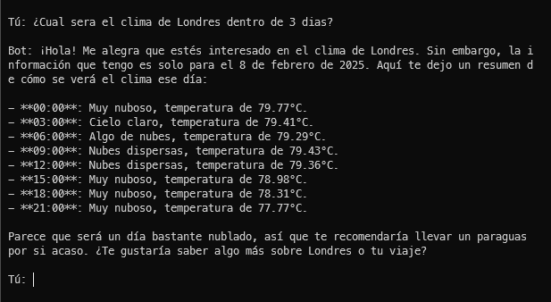
## Tecnologias y Librerias
Las tecnologias que se utilizaron fueron las siguientes:

 
 |Tecnologia | Motivo  |
 |:---------:|:-------:|
 |`Typescript`| Lenguaje utilizado para programar el bot |
 |`Axios`    | Libreria para consumir la api de OpenWeatherMap| 
 |`LangGraph`| Libreria utilizada para estructurar el modelo del asistente|
 |`Express`  | Framework para construir la api del bot|

 ### Modelo de Grafo
A continuacion se muestra el diagrama de grafo que expone la forma en la que se penso el Asistente de Viajes. 

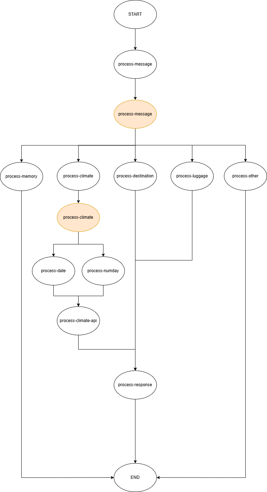
