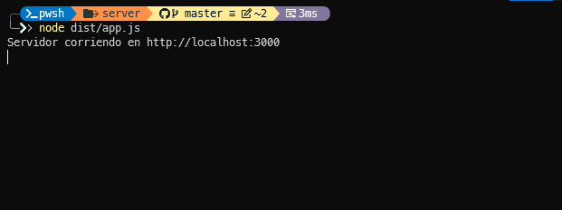
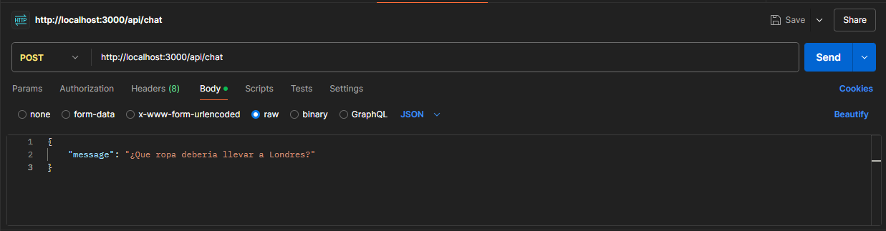
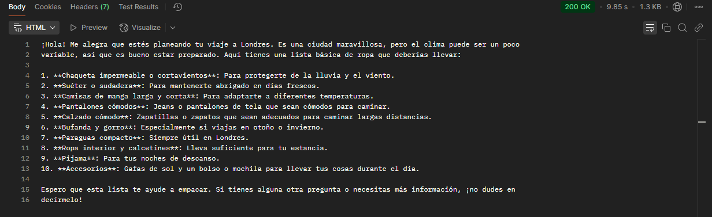
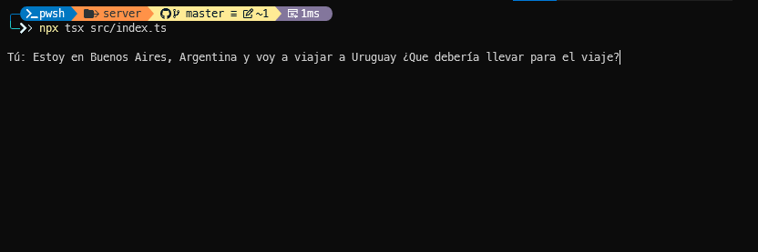
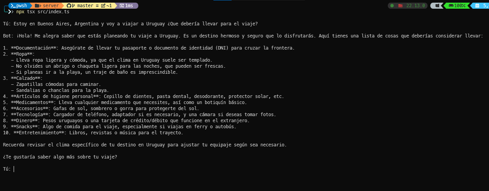

# Asistente de Viajes

Para la persona con poco tiempo quienes quieran organizarce para realizar un viaje, el Asistente de Viajes es un bot con inteligencia artificial que te ayuda a responder consultas sobre destinos, sus climas y recomendacion de equipaje. Diferente a otros bots cuyo unico trabajo es trabajar solo con apis y sin respuesta en lenguaje humano. 

## Caracteristicas unicas
1. **Respuestas conversacionales**
    - Trabaja con el modelo de LLM `gpt-4o-mini-2024-07-18` para enternder preguntas coloquiales y responder de forma rapida, precisa y amigable.
2. **Clima en tiempo real** 
    - Integra la api de OpenWeatherMap y la presenta de forma amigable.
3. **Seguimiento contextual**
    - Puede manejar preguntas adicionales sin perder el hilo de la conversacion.
    - Te responde con datos concretos y estructurados.
    - Si le preguntas de temas que exceden su objetivo, para y te pide que le consultes de temas que conoce.
 
## Empezar a utilizar 
El bot se puede utilizar tanto local, como desde la siguiente api:
 `https://asistente-de-viajes.vercel.app/api/chat`

### ¿Donde probar la api?
Para testear la api se pueden utilizar herramientas como [Insomnia](https://insomnia.rest/) o [Postman](https://www.postman.com/). 
### ¿Como se utiliza?
Para trabajar con la api de asistente de viajes, se le debe enviar un body con el siguiente formato.

```js
{
    "message": "<consulta>"
}

```

**Ejemplo:**
```js
{
    "message": "¿Cómo estará el clima en Buenos Aires, Argentina, dentro de dos días?"
}
```


### Utilizar el bot en local
Antes de utilizar el asistente en tu maquina tenes que tener en cuenta los siguientes prerrequisitos:
    
1. Tener instalado [Node.js]() y [Git]().
2. Tener una ApiKey de [OpenAI]() y [OpenWeatherMap]().

Una ves conseguidos los prerrequisitos toca clonar el repositorio de la siguiente manera:
```sh
git clone https://github.com/ElianBorda/asistente-de-viajes.git
cd asistente-de-viajes
npm install
```
Despues de clonar y acceder al repositorio, se debe crear un archivo .env para agregar las apikey y la base url de la api de OpenWeatherMap. 
```js
API_OPENWHATER = "http://api.openweathermap.org/data/2.5"
API_OPENWHATER_KEY = "..."
OPENAI_API_KEY = "..."
```
Por ultimo, deben corren la api local de la siguiente forma:
```sh
npx tsc
node dist/app.js
``` 
Una ves realizado el ultimo paso, les aparecera el mensaje `Servidor corriendo en http://localhost:3000`:
 

**Muestra:**



### Chatear con el bot
Si instalas el bot local tenes la opcion de **chatear con el asistente en tiempo real**. Solamente se necesita escribir el siguiente comando:

```sh
npx tsx src/index.ts
```

**IMAGENES ESCRIBIENDO POR CHAT CON EL ASISTENTE:**




