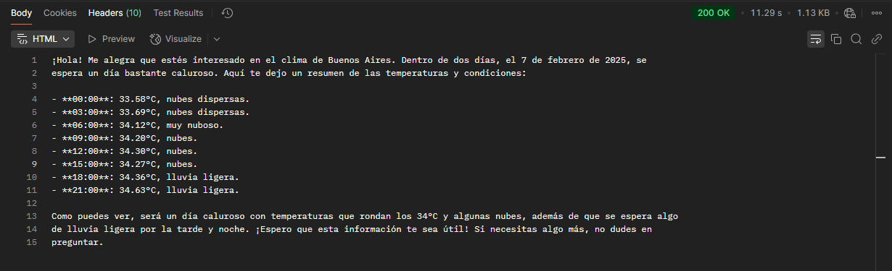

# Asistente de Viajes

Para la persona con poco tiempo quienes quieran organizarce para realizar un viaje, el Asistente de Viajes es un bot con inteligencia artificial que te ayuda a responder consultas sobre destinos, sus climas y recomendacion de equipaje. Diferente a otros bots cuyo unico trabajo es trabajar solo con apis y sin respuesta en lenguaje humano. 

## Caracteristicas unicas
1. **Respuestas conversacionales**
    - Trabaja con el modelo de LLM `gpt-4o-mini-2024-07-18` para enternder preguntas coloquiales y responder de forma rapida, precisa y amigable.
2. **Clima en tiempo real** 
    - Integra la api de OpenWeatherMap y la presenta de forma amigable.
3. **Seguimiento contextual**
    - Puede manejar preguntas adicionales sin perder el hilo de la conversacion.
    - Te responde con datos concretos y estructurados.
    - Si le preguntas de temas que exceden su objetivo, para y te pide que le consultes de temas que conoce.
 
## Empezar a utilizar 
El bot se puede utilizar tanto local, como desde la siguiente api:
 `https://asistente-de-viajes.vercel.app/api/chat`

### ¿Donde probar la api?
Para testear la api se pueden utilizar herramientas como [Insomnia](https://insomnia.rest/) o [Postman](https://www.postman.com/). 
### ¿Como se utiliza?
Para trabajar con la api de asistente de viajes, se le debe enviar un body con el siguiente formato.

```json
{
    'message': <consulta>
}

```

**Ejemplo:**
```json
{
    'message': ¿Cómo estará el clima en Buenos Aires, Argentina, dentro de dos días?
}
```


### 


